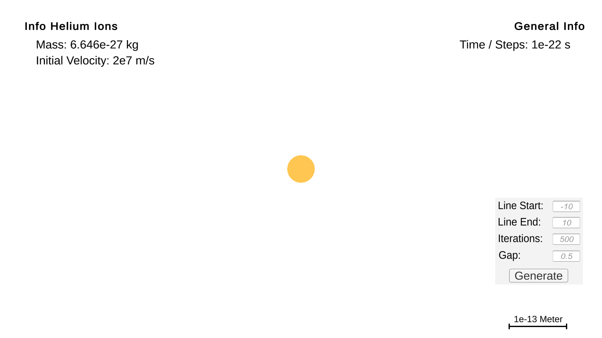

<h1 align="center">Rutherford Scattering</h1>

---

<h3 align="center"> AM Projekt 2023</h3>
<h4 align=center>~ by Leandro Ferrer & Diego Schindele ~</h4>

 Made with 
  
  

---

 

## Inhalt
- [Inhalt](#inhalt)
- [Anleitung](#anleitung)
- [Beschreibung](#beschreibung)
- [Aufgabestellung](#aufgabestellung)
- [Planung](#planung)
  - [Fragen](#fragen)
  - [Sketches \& Ideen](#sketches--ideen)
- [Rückschläge](#rückschläge)
- [Lösung](#lösung)
  - [Erster Schritt](#erster-schritt)
  - [Zweiter Schritt](#zweiter-schritt)
  - [Dritter Schritt](#dritter-schritt)
  - [Vierter Schritt](#vierter-schritt)
- [Berechnung](#berechnung)
- [Unsere Quellen](#unsere-quellen)

## Anleitung

  

  <i>Unser Programm.</i>

1. Führen Sie die Datei `Rutherford Scattering.exe` aus.
2. Drücken Sie auf den Button `Generate`.
3. Sie können das Ergebnis anschauen, indem Sie die Kamera mit der Maus bewegen.  Klicken Sie dafür auf die Anwendung und bewegen Sie die Maus. 
   *Jede Linie repräsentiert den Pfad eines Alphateilchen.*
4. Ändern Sie die Werte der Inputs und drücken Sie auf den Button `Generate` um ein neues Ergebnis zu erhalten.
5. Mit `F2` können Sie einen Screenshot machen. Dieser wird in Ihrem `Bilder` Ordner gespeichert.

## Beschreibung
Beim Rutherford Streuversuch werden Alphateilchen auf eine Goldfolie gestrahlt. Die Alphateilchen sind positiv geladen und haben keine Elektronen. Ziel des Versuchs ist es zu sehen, ob und wie die Alphateilchen abgelenkt werden. Um die Bewegung der Teilchen nach dem Auftreffen auf die Goldfolie zu sehen, gibt es einen Leuchtschirm um die Folie herum.

Insgesamt erklärt das Atommodell von RUTHERFORD mit dem Atomkern die drei wesentlichen Ergebnisse des Experiments von GEIGER und MARSDEN:

>1. Der Kern ist so klein, dass sich die überwältigende Mehrheit aller Alphateilchen ohne jegliche Ablenkung durch die Goldfolie hindurchbewegt, als wäre dort nichts. Es sieht so aus als wäre das Atom ein hauptsächlich leerer Raum. Die Wechselwirkung der geladenen Alphateilchen mit den Hüllenelektronen führt wegen der relativ hohen kinetischen Energie der Alphateilchen und der im Vergleich zu den Elektronen viel größeren Masse zu keiner nennenswerten Ablenkung.

>2. Nur einige Alphateilchen gelangen beim Durchgang durch die Folie so nahe an einen Atomkern, dass die elektrische Abstoßung der beiden positiv geladenen Körperchen zu einer geringfügigen Ablenkung des Alphateilchens um ein oder zwei Grad führt. Die Wahrscheinlichkeit für diese Nähe zum Kern und die daraus resultierende Ablenkung wurden durch RUTHERFORD und seine Mitarbeiter berechnet und mit den Versuchsergebnissen verglichen. Es gab eine sehr gute Übereinstimmung.

>3. Nur ganz wenige Alphateilchen treffen fast direkt auf die Mitte des Atoms. Die Alphateilchen, die sich mit etwa 10 % der Lichtgeschwindigkeit dem Atomkern nähern, werden durch dessen elektrische Kräfte vollelastisch "reflektiert". Da das Alphateilchen wesentlich leichter als der Goldkern ist, wird es auf einer hyperbelförmigen Bahn "reflektiert", so dass es um einen Winkel von 90° und mehr abgelenkt wird. Der Kern nimmt bei diesem Stoß nur geringfügig Energie von den Alphateilchen auf, die aber nicht ausreicht, um das Atom aus dem Metallverbund zu lösen.

Zitat (Lefiphysik)

## Aufgabestellung
Uns wurde beauftragt diesen Streuversuch zu simulieren und in einem GUI darzustellen.

## Planung
1. Wir wollten Unity verwenden um die 3D Objekte zu erstellen und die Physik zu simulieren.
2. Nach Recherche haben wir uns entschieden dies in Python zu machen, da es einfacher ist und wir uns in Python besser auskennen.
3. Python ist nicht für GUIs geeignet, deshalb sind wir zurück zu Unity und C#.
4. Wir haben uns entschieden das Projekt in Unity in 2D zu erstellen.

###  Fragen
- Q: Sollte ein einzelnes Goldatom oder ein Goldplättchen dargestellt werden? 
> A: Wir haben uns für ein einzelnes Goldatom entschieden, da man die Ablenkung der Alphapartikel besser sehen kann.
- Q: Wie sollten die Alphapartikel und das Goldatom dargestellt werden? 
> A: Alphapartikel sind zu klein um sie darzustellen, sieht man nur den Pfad eines Ions. Für das Gold haben wir uns für ein Kreis entschieden.
- Q: Wie viele User Inputs sollten zur Verfügung gestellt werden?
> A: Wir haben uns für 4 Inputs entschieden: 
  > 1. Der Startpunkt der Alphapartikel auf der Y-Achse.
  > 2. Der Endpunkt der Alphapartikel auf der Y-Achse, was addiert mit dem Startpunkt, auch die Anzahl der Alphapartikel ist.
  > 3. Die Anzahl der Iterationen (Schritte) die die Alphapartikel machen.
  > 4. Der Abstand zwischen den Alphapartikeln.
- Q: Wie schnell sollte der Output erscheinen? 
> A: Der Output erscheint sobald man auf den Button klickt.
 
### Sketches & Ideen

*Erster Versuch mit Unity.*
 
 

*Formel für die Berechnung der Ablenkung der Alphapartikel. Von Herrn Küng bereitgestellt.*

## Rückschläge

Anfänglich wollten wir dies in Unity mit C# simulieren, jedoch hat sich dies als zu komplex und zeitaufwendig herausgestellt und wir haben nur die 3d Objekte eingebaut (siehe 'Erster Versuch mit Unity'). 
In diesem ersten Projekt hatten wir noch keinen Code geschrieben, sondern nur eine Physik simulation mit Unity erstellt. Herausgestellt hat sich, dass man kein Alphapartikel in Echtzeit simulieren und gleichzeitig sehen kann.

Mit Python sind wir kaum weiter gekommen, weil Python nicht geeignet für GUIs ist. Wir haben uns dann entschieden das Projekt in Unity in 2D zu erstellen.

## Lösung
### Erster Schritt
Wir haben mit dem LineRenderer experimentiert, bis wir damit umgehen konnten.

### Zweiter Schritt
Der längste und schwierigste Schritt war die Berechnung der Ablenkung der Alphapartikel. Wir haben Herrn Küngs Formeln verwendet und erstellten eine Funktion, die die Ablenkung berechnet. Diese Funktion haben wir dann in eine andere Funktion eingebaut, die die Pfade dann zeichnet.

### Dritter Schritt
Wir haben die GUI erstellt und die Inputs mit den Funktionen verbunden.

### Vierter Schritt
Wir haben einige extra Features hinzugefügt. Namentlich die Möglichkeit die Kamera zu bewegen und Screenshots zu machen.

## Berechnung
Im Prinzip haben wir nur 4 Formeln verwendet.

1. Coulombsches Gesetz

$$F_C=\frac{1}{4\cdot\pi\cdot\epsilon_0}\cdot\frac{q_1\cdot q_2}{r^2}$$

2. Das zweites newtonsches Gesetz 

$$F=m\cdot a $$ 
$$\Rightarrow a=\frac{F}{m}$$

3. Die Geschwindigkeit

$$v_1=v_0+a\cdot \Delta t$$

4. Die Position

$$x_1 = \frac{1}{2}\cdot a\cdot(\Delta t)^2+v_0\cdot \Delta t+x_0$$

Diese Formeln haben wir in C# realisiert, indem wir für jeweils $x$, $y$, $v$, und $a$ ein Array erstellt haben. Die Formeln wurden dann in einer Schleife ausgeführt, die so oft durchlaufen wird, wie die Anzahl der Iterationen ist.
 
Die $x$ und $y$ Werte wurden dann in einem Vector gespeichert und dieser wurde dann in den LineRenderer eingefügt. Ein Arraypaar entspricht einer Linie.
 
## Unsere Quellen
>[Studyflix](https://studyflix.de/ingenieurwissenschaften/rutherford-streuversuch-1815)

>[Physics Simulations in Python](https://physics.weber.edu/schroeder/scicomp/PythonManual.pdf)

>[Lefiphysik](https://www.leifiphysik.de/atomphysik/atomaufbau/versuche/rutherford-experiment)

>[Unity Docs](https://docs.unity.com/)